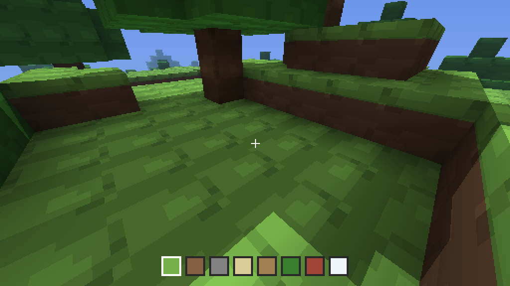

# Bendcraft

An endless voxel world you can walk, jump, break and build, written in
[Bend](https://github.com/bendlang/bend) and rendered by one parallel call:
on the GPU through Metal, or on every core of your machine as WebAssembly.

**Play it in the browser:** https://adrielsantana.github.io/bendcraft/

`W A S D` walk · `space` jumps · drag the mouse to look (or the arrows) ·
click breaks · right click places (or `J` / `L`) · `1`–`8` choose the block
to place (grass, dirt, stone, sand, wood, leaves, brick, snow) · `P` saves ·
`F` shows the frame's time · `Esc` quits and saves.



## Build and run

Bend 2.0.23 or later (`bend update`). On a Mac with Metal:

```sh
make            # bend main.bend -o build/bendcraft
make run        # ./build/bendcraft --gpu 2GB            a 512 x 512 window
make full       # the screen's visible size, half as many rays a side
./build/bendcraft --gpu 2GB 1470 796 2                   # the same, by hand: a 14" MacBook
```

The two numbers are the window in points (a Retina screen has twice the
pixels: 1470 x 956 points on a 14" MacBook, 2560 x 1664 pixels), the third
how many times fewer pixels a side the render has (a power of two; 1 when
left out). The window's shader walks the image quadtree from the window's
size and stops at the first pixel it meets, so a coarser render scales up
by itself, nearest neighbour, which suits the pixel art. `make full` asks
the screen for its visible size with a line of Swift and takes the title
bar off, at scale 2; `make full SCALE=1` is a ray for every pixel, 16 ms a
frame on a 14" MacBook. The costs are in the table below, and `make profile`
says what each part of a frame costs.

The page is built with the web target of Bend from
[bendlang/bend#866](https://github.com/bendlang/bend/pull/866), a checkout
of that branch:

```sh
make page BEND_WEB=../bend-web/bend2/main.ts   # site/index.html, index.js, index.wasm
make publish                                   # the same onto the gh-pages branch
```

## How it works

**The world is one array, shared by every pixel.** `Array` in Bend has one
owner. Since 2.0.22 an `@unsafe` def may hand one array to both sides of a
fork anyway, two handles to one block that `Array.join` gives back, so the
columns around the player live in an `Array<U32>`: eight words a column,
the first a mask whose bit `y` says "there is a block at height `y`", the
next four the types of its 32 blocks, four bits each. A ray reads the mask
through its handle once per column it crosses and the type once, at the
hit; an edit is a few `Array.set` on the host; a built world costs what an
untouched one does. Thirty-two heights in one word is what makes it cheap:
the ray sees a column as a machine word, and break or place is one bit.

**The world is endless.** The terrain is seeded value noise, three octaves,
a pure function of `(x, z)`: grass on top, sand where it is low and snow
where it is high, three of dirt under the top, stone below. About one grass
column in eighty grows a tree, a trunk of four wood with a canopy of leaves
over the columns around it; a column takes its wood and leaf bits from the
trees of the 25 columns around it, so a canopy crosses columns without
anyone writing across. The array holds
a ring of 128×128 columns around the player, and a `Map` holds the columns
the player edited. World column `(x, z)` sits at slot `(x·128 + z)·8`; the
array reads its index modulo its size, so any 128×128 window falls
one-to-one on the 16384 column slots, and a reader carries one word,
`base = ox·128 + oz`, to find local column `(lx, lz)`. The render and the
physics only see local coordinates in `[0, 128)`. The corner follows the
player one column at a time, loading the row that came into view, from the
map if it was edited and from the noise if not; an edit is a bit and a
nibble in the ring and the whole column in the map, so it is there when
you come back.

**The render** is a DDA through the ring, one ray per pixel, 60 steps. The
loop returns only what was hit and where; the look is a `match` after it:
a second DDA toward the sun for shadows, a pixel-art tile of four shades per
face, ambient occlusion per vertex from the eight cells around the hit, distance haze and low mist into the sky along the ray. The `!` runs a binary tree down to 4×4 tiles: a
square splits into its two rows, a row into its two squares, as many levels
as the larger side needs, and a half that lies past the render's edge is
one pixel and never a task. The shape follows the GPU runtime, which grows
a frontier of tasks two-way a turn until each of the 128 lanes of a group
holds one, then runs each task on its lane to the end: a two-way tree fills
the frontier with tasks of one size, so a wide frame at every pixel takes
16 ms where the four-way tree took 46, and its pruned form, with some lanes
holding 64 leaves, 110 to 150.

**The day clock** is an integer in `Game`, advanced by elapsed milliseconds
at the window loop, independently of the physics and frame rate. One day is
1048576 ms (17 minutes 28.576 seconds); phase zero is dawn, one quarter noon,
one half dusk and three quarters midnight. Its sine and cosine are computed
on the host and the three sun components ride in `Cam`. The shadow walks
with signed steps on all three axes; the terrain dims when the sun sets.
The default starts in the morning. A world-direction sky gradient follows
the sun's height, with a warm glow toward dawn and dusk, a sun disc, fixed
stars fading in at night and a moon opposite the sun. Fog takes the gradient
and glow's colour, without celestial discs; its distance term reaches the
sky at 34 blocks, before the 60-step ray budget ends even on a diagonal.
A separate height term thickens in the low ground.

**The world is saved.** `bendcraft.save` in the working directory holds
the corner, position, look, chosen block and day clock on its first line,
then one line per edited column: its key and its five words. The game
loads it at start, if it is there, and writes it on `P` and on quit; the
untouched columns are never stored, they come back from the noise. On the
page the file lives in the browser's memory, so it lasts until the tab is
closed. Old headers without the optional clock still load, at morning;
the column lines have not changed.

**The player** is 1.8 blocks tall with the eye at 1.6. Walking tests the
feet and the head per axis and stops at walls; gravity pulls, landing snaps
the feet onto the block, space pushes off it. A block is never placed on
the player. The hotbar along the bottom shows the eight block types and
frames the chosen one.

## Layout

```
main.bend          the window loop, elapsed time, the view, the tick
src/day.bend       integer day phase and the sun direction
src/sky.bend       sky gradient, sun, glow, stars, moon and distance/height fog
src/util.bend      conversions, bit tests, smoothstep
src/world.bend     noise, terrain, the ring, the map, loads, shifts, edits, solid
src/render.bend    the DDA, the sun, the texture, the occlusion, the fork
src/player.bend    Game, events, picking, the tick
src/save.bend      the save file, and the tick that writes it
LAWS.bend          the rules the checker proves; PROOF.bend closes them
AGENTS.md          for an agent (or a person) about to write Bend here: the gate, the rules
ROADMAP.md         the vision and what comes next: the look, the game, the laws, what waits on Bend
test/physics.bend  the game without a window: events through feed and step
test/save.bend     place, walk, save, load: the brick and the position come back
test/day.bend      signed shadows, sky/fog, clock wrapping, frame rate, old and new saves
test/sky.bend      six fixed sky views, saved as Image trees for test/sky.py
test/bench.bend    five frames on the GPU with checksums, untouched and built
test/profile.bend  what costs what: each look off in turn, the rays' hits and steps
test/trace.py      the frame's dispatch kernel by kernel, from the emitted C
test/terrain.bend  rows of the terrain, to see the noise
test/readout.bend  the readout's corner of a frame, printed a character a pixel
test/page.mjs      the page in headless Chrome: drag, click, place, jump
test/fps.mjs       the page's fps on N threads
site/              the page: notes.mjs post-processes the built index.html
```

```sh
make check      # the modules, the tests, the laws
make test       # physics, save and load, terrain, windowless
make bench      # five frames on Metal, untouched and with 300 blocks placed
make profile    # each look off, by size; also stars and moon active at night
make sky        # six PNGs and build/sky-contact.png; Python with Pillow
make page-test  # the page in headless Chrome, hashes and fps
```

## Numbers

Apple M5, Bend 2.0.24. The historical tree comparison below predates the
day cycle; the current measurements follow it. The bench times
the `!` only, five frames with the camera turning; the thirty checksums are the same on every build that
changes nothing visible. The first column is the binary tree, the second
the four-way tree it replaced.

| | binary tree | four-way tree |
|---|---|---|
| Metal, 512×512 | 3 ms a frame | 7 ms |
| Metal, 512×512, 300 blocks placed | 3 ms | 7 ms |
| Metal, 735×398 rays, a 14" MacBook at scale 2 | 5 ms | 18–29 ms |
| Metal, 960×540 rays, a 1920×1080 window at scale 2 | 9–10 ms | 14–17 ms |
| Metal, 1470×796 rays, a 14" MacBook at every pixel | 16 ms | 46 ms |
| Metal, 1920×1080 rays | 28–31 ms | 50 ms |
| WebAssembly, 512×512, 10 threads | 31 fps | 37 fps |
| WebAssembly, 512×512, 1 thread | 7 fps | 7 fps |
| WebAssembly, 512×288 rays in a 1024×576 canvas, 10 threads | 54 fps | 54–56 fps |

After sky and day cycle, four alternated rounds against the original build:

| fastest bench frame | before | after |
|---|---|---|
| 512×512 | 2 ms | 2 ms |
| 512×512, 300 blocks placed | 2 ms | 2 ms |
| 735×398 | 4 ms | 4 ms |
| 960×540 | 8 ms | 9 ms |
| 1470×796 | 15 ms | 16 ms |
| 1920×1080 | 28 ms | 30 ms |

The extra work is the signed shadow, sky colour and height/distance fog;
the larger frames pay for that arithmetic at more pixels. The rays-alone
profile remains 11.0 ms at 1470×796. Web numbers have not been remeasured.

On the page, `?size=1024x576x2` in the address gives the wide frame, and
the fullscreen link scales whatever is rendered to the screen.

## What costs what

`make profile` renders one view five times with every look on, then with
each look off in turn (the camera's `fl` flags: shadow, occlusion, texture,
distance fog, HUD, day cycle, gradient, sun, glow, stars, moon, height fog),
then the rays alone, and prints the `!` per frame; then it
renders the view twice more with numbers for pixels, how many rays reach
a block and how many DDA steps a ray walks to its hit, summed over the
image with each pixel weighed by the square it stands for. The same
view as the bench is used for the full render (the profile sums by pixel
area; the bench sums the tree's leaves). At 1470×796:

Four alternated original/final rounds, minimum five-frame mean per variant
(the timer resolves milliseconds). The full profile grows by 0.8 ms;
shadow-off grows by 0.6 ms with the new atmosphere, while rays alone stay
unchanged. Differences of a few tenths, including an off variant slower
than all-on, are measurement noise; these are not additive cost estimates.

| | before | after, ms a frame |
|---|---|---|
| all on | 15.2 | 16.0 |
| shadow off | 12.6 | 13.2 |
| occlusion off | 14.2 | 15.2 |
| texture off | 15.0 | 15.8 |
| distance fog off | 15.0 | 16.2 |
| HUD off | 15.2 | 16.2 |
| day cycle off | — | 16.4 |
| sky gradient off | — | 16.0 |
| sun disc off | — | 16.0 |
| horizon glow off | — | 15.8 |
| stars off | — | 16.0 |
| moon off | — | 16.2 |
| height fog off | — | 16.0 |
| rays alone | 11.0 | 11.0 |

Stars and moon are skipped in this morning view. The profile also looks
up at midnight, at 1470×796: all on 11.8 ms, stars off 11.4, moon off
11.8, rays alone 10.6. The moon is visible in that view. The gradient and
fog take no extra ray; the sun and moon are angular discs and the stars
are a fixed hash of direction.

`Cam.fl` bits 0..4 are shadow, occlusion, texture, distance fog and HUD;
5 and 6 are debug renders; 7..24 hold the readout. Bits 25..31 are day
cycle, sky gradient, sun disc, horizon glow, stars, moon and height fog.
`Render.looks()` enables them all. Day cycle off uses the original fixed
sun for profiling. The new picture changes on purpose: bench digest
`78d5ae6b7301de08432c237f1bbecc0b`; physics stays
`73516c0ead87f8c1151e34d25b3ac32e`.

52 % of the rays reach a block, after 24 steps on average; the rest walk
the box's 60. So the primary rays are three quarters of the frame and the
shadow ray most of the rest; the occlusion and the texture cost under a
millisecond each, the fog and the HUD nothing measurable. Two lessons
came out of the first run. A ray that stopped at its hit walked a third
of the steps and made the frame slower, 15 → 17 ms here and 28 → 32 at
1920×1080, with the same checksums: the lanes of a SIMD group then leave
the loop at different steps, and the runtime's switch over segments runs
them one case at a time, so the loop walks its 60 steps with the state
frozen, on purpose. And a `Bool.pick` is strict, so a look that is off
must be skipped by a `match`, or it is paid for anyway.

`test/trace.py` goes one level down: it patches the emitted C so the
frame's single dispatch runs as four command buffers, one a kernel, and
prints each kernel's time and the tasks left in the lanes' rings
(`bend test/bench.bend -o build/bench.c && python3 test/trace.py
build/bench.c && ./build/bench_trace`). For the 1470×796 frame: grow1
0.4 ms leaving 128 tasks, grow128 2.0 ms leaving 11504 tasks one a ring,
work 10.3 ms, pack 0.5 ms. It reaches into the runtime's text, so a new
Bend may need its snippets updated; it is a diagnostic, not part of the
build.

## The frame's time, in the game

`F` puts a readout in the frame's corner: `16.4 MS  60 FPS`. The first
number is the `!` alone, the render, as the bench times it; the second is
the frames that reached the screen, which the display's rate caps, so a
render of 5 ms still reads 60 or 120. `main.bend` runs the window's loop
itself, in `App.run`'s shape, to read the clock on each side of the view
and not around the wait for the screen; twice a second it publishes the
mean since. The two numbers ride to the GPU in the flags word, above the
looks, and the HUD draws them with glyphs of 3 × 5 picked by divisions
and masks (no table, no variable shift). With the readout off the frame
is the same bit for bit: the bench's checksums and its times did not move.

## Laws

`LAWS.bend` states what the checker can decide: integer and bit rules on the
values the game uses. The pick word packs and unpacks; a 128×128 window of
the ring spans its 16384 column slots exactly; placing sets one bit,
breaking clears it, breaking air changes nothing; a type's nibble writes
and reads back without touching its neighbours, and the device's read (a
select, since the GPU never shifts by a variable) agrees with the host's;
the terrain's layers are what they should be, a trunk packs as wood with
leaves over it and grass under it, and the packed word the loader writes
reads back the same; no key touches the mouse's bits of the held mask;
the readout's numbers ride above the looks without touching them, read
back, and stop at their room even with high look flags set. The day phase
returns after a whole turn for every `U32` clock value, including overflow,
proved by induction over the low 20 bits. This is the sun's sole integer
input. Its last millisecond advances to dawn. There are 40 laws: this
universal period law and 39 concrete checks.
`bend PROOF.bend` is the gate. The float physics, a player
never inside a block or a jump that lands where it left, is checked by
`test/physics.bend`, whose lines the README of the history records.

## History

Bendcraft began as `gfx/05_craft.bend` in
[metal-bending](https://github.com/AdrielSantana/metal-bending), a notebook
of what Bend costs on Metal. The wall it hit there, an editable world read
through a shared tree, was
[bendlang/bend#885](https://github.com/bendlang/bend/issues/885); Bend
2.0.22 answered it with the array fork, and this repository carries that
file's history from its first commit. Open upstream:
[#920](https://github.com/bendlang/bend/issues/920), a WGSL lane so the page
could run its `!` on WebGPU, and
[#921](https://github.com/bendlang/bend/issues/921), a way to grab the mouse,
[#923](https://github.com/bendlang/bend/issues/923), a way to go full
screen, and [#925](https://github.com/bendlang/bend/issues/925), the shape
of the frame's tree deciding the lanes' load, with a 90-line reproduction.

Written by Claude (Anthropic) with Adriel Santana.
