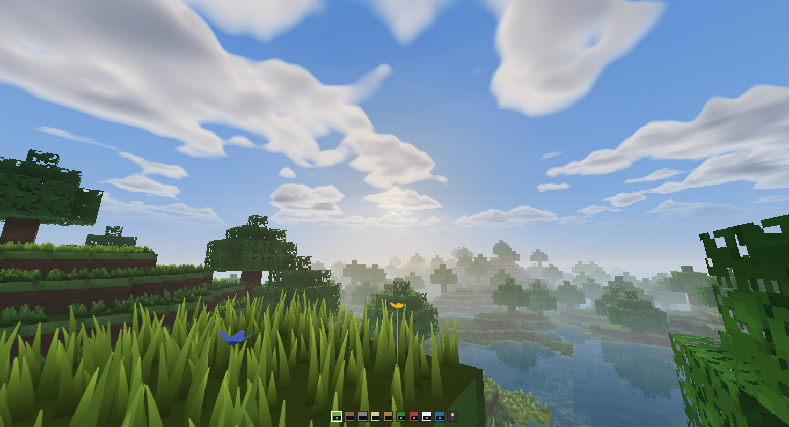
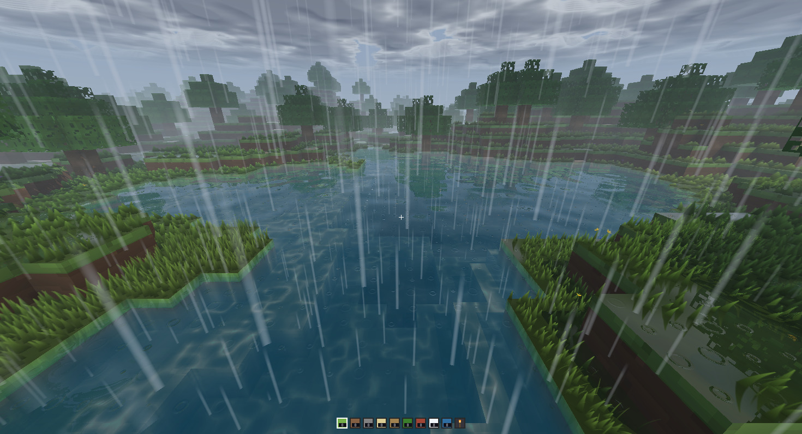
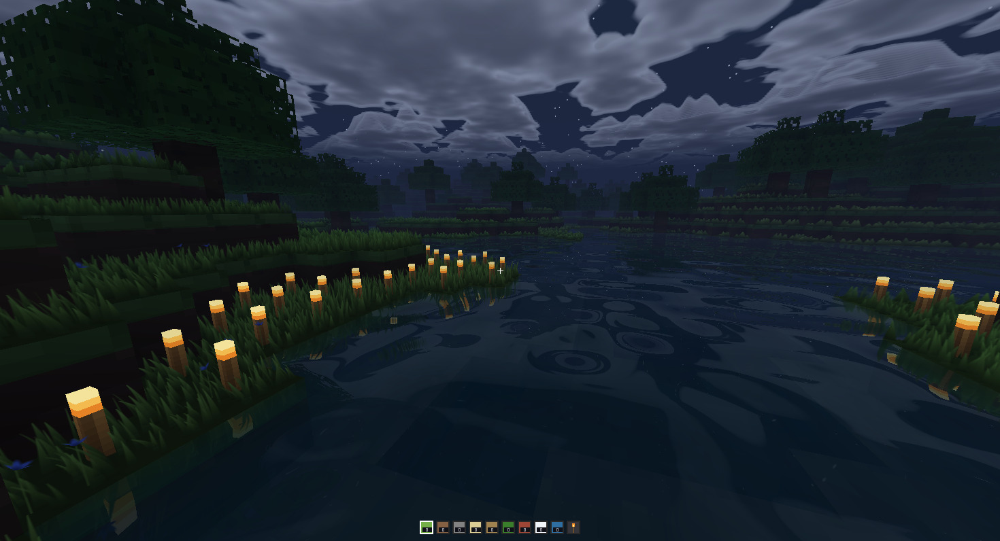
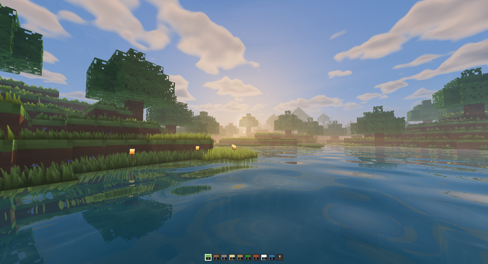
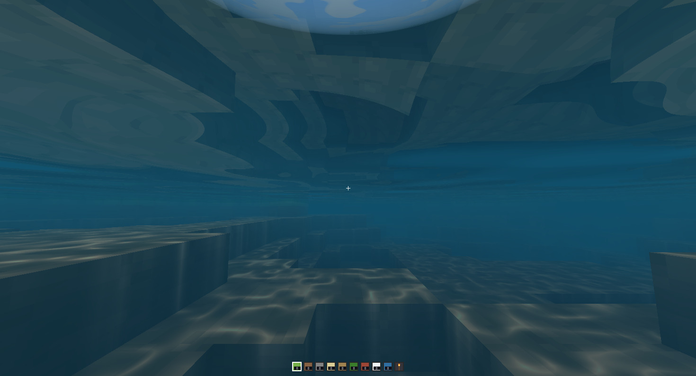

# Bendcraft

A voxel world you can walk, dig and build in, with water that flows,
clouds that bring rain, grass that bends in the wind and torches that
light the night. It is written in [Bend 2](https://github.com/bendlang/bend),
a pure, proof-checked functional language, and each frame is one parallel
call of it on the GPU: no OpenGL, no shader code, no engine.



## Written by an AI, checked by a compiler

Bendcraft was written by Claude (Anthropic), with Adriel Santana directing.
Bend 2 is newer than Claude's training data, so the model learned it as
any agent here does: from `bend guide`, the compiler's own guide, and from
the code already written. [AGENTS.md](AGENTS.md) is the whole brief. Adriel
judged each look from renders and in the game, and the commit log keeps
every decision with its measurements.

What makes that safe is the other half of Bend. The rules the game
promises are laws in [`LAWS.bend`](LAWS.bend), and `bend PROOF.bend`
proves all 145 of them before every commit. Nine hold for every input;
the rest are checked on the exact values the game uses. For example:

- a cell and its inventory count keep the same total after any list of
  breaks and places;
- the sun comes back to the same place after a whole day, for every value
  of the clock's word, overflow included;
- a block placed in water shoves its water up the column;
- a torch's cell holds light 14, and a column with no torch holds no light
  of its own.

The AI writes; the compiler proves. What the checker cannot decide, the
float physics (a player never inside a block, a jump that lands) and the
water's volume through the flow, is checked by windowless tests, 261 of
them.

## What is in it

- **An endless world** from a seeded noise: hills, lakes, beaches, snow
  and trees, and past the loaded window a far map that carries the land
  to the fog, 120 blocks away, block for block.
- **Water that flows**: a byte of water a cell, moved down and sideways
  by a rule that keeps the volume; a bucket to carry it; swimming. It
  mirrors the sky and the world, ripples, and from under it shows Snell's
  window.
- **Days, nights and weather**: the sun and the moon light the world in
  their colours, clouds with volume drift in the wind, and heavy days
  bring rain that rings the water, wets the ground and leaves puddles.
- **A meadow**: tall grass and flowers to 40 blocks, and leaves with holes
  that let the sun through, all moving with the wind.
- **Light**: shadows, soft corners, a lens flare, the sun's light in the
  haze, and torches whose light spreads cell by cell, around a block and
  not through it.
- **A game**: break and place eight kinds of block, an inventory that
  counts them, saves that keep your world.

| | |
|---|---|
|  |  |
|  |  |

## Play

`W A S D` walk · `space` jumps, and swims up in water · the mouse looks
(or the arrows) · click breaks · right click places (or `J` / `L`) ·
`1`–`8` or the wheel choose the block to place (grass, dirt, stone, sand,
wood, leaves, brick, snow) · `9` the bucket: a click takes a cell of
water, a right click pours one · `0` the torch: in the hand it lights
what is near, and a right click stands one on the ground · `P` saves ·
`F` shows the frame's time · `Esc` quits and saves. For a demo: `H` held
runs the day 64 times as fast and `G` back, and `C` turns the weather at
the same hour, to the next day of rain or, from rain or wet ground, of
dry.

You start with an empty inventory. Break a block to collect its type;
placing spends one of the chosen type.

## Build and run

Bend 2.0.34 with three changes not released yet:
[bendlang/bend#1132](https://github.com/bendlang/bend/pull/1132) (the lanes
after a grow), and two of ours to the code it emits: a def that a loop
calls is inlined whatever its size, and a loop over a Nat checks for
errors once, as it enters. A frame takes 2.7 to 2.8 times less than on
stock 2.0.34.
The Makefile runs it with `bun` from a checkout beside this one;
`make BEND=bend` builds with the installed Bend.

```sh
git clone -b bendcraft https://github.com/AdrielSantana/bend ../bend
```

On a Mac with Metal:

```sh
make            # bend main.bend -o build/bendcraft
make run        # a 512 x 512 window
make full       # the screen's visible size, half as many rays a side
./build/bendcraft --gpu 2GB 1470 796 2    # by hand: a 14" MacBook, half the rays a side
```

The first two numbers are the window in points, the third how many times
fewer pixels a side the render has (a power of two, 1 when left out). The
window scales a coarser render up, nearest neighbour, which suits the
pixel art. A version in the browser is not ready yet: it waits to run on
WebGPU.

How fast, on an Apple M5, the fastest of five frames with the camera
turning (`make bench`, 2026-09-30):

| render | a frame |
|---|---|
| 735×398, a 14" MacBook at half the rays a side | 14 ms |
| 960×540, a 1920×1080 window at half the rays a side | 26 ms |
| 1470×796, a 14" MacBook at a ray every pixel | 51 ms |

## How it works, briefly

- **A frame is a value.** `view : Game -> Game & Image`, and an `Image` is
  a quadtree of colours. There is no framebuffer to write and no draw
  call: the window shows the tree the game returns.
- **One parallel call a frame.** The frame's tree forks down to 4×4 tiles,
  and one `!` hands the whole tree to the GPU. Nobody writes a kernel, a
  thread or a lock.
- **A ray a pixel.** It is a ray caster, not a rasteriser: a ray walks the
  voxel grid and the first block it meets is what the pixel shows.
  Shadows, reflections, clouds, rain and grass are more walks and more
  arithmetic along the ray.
- **The world is one array** every ray reads. A column's 32 blocks are one
  32-bit word, so breaking or placing a block flips a bit.
- **State is threaded, effects sit at the edge.** The step, the physics,
  the picking and the render are pure functions, so the whole game runs
  in tests with no window.

## Read more

- [docs/engine.md](docs/engine.md): how each part works, what each look
  costs, the laws, the files.
- [docs/roadmap.md](docs/roadmap.md): where it goes next, and what was
  tried and failed.
- [docs/perf.md](docs/perf.md): what a ray caster can do to cost less,
  each technique measured.
- [AGENTS.md](AGENTS.md): the brief an agent works from here.

## History

Bendcraft began as `gfx/05_craft.bend` in
[metal-bending](https://github.com/AdrielSantana/metal-bending), a notebook
of what Bend costs on Metal. The wall it hit there, an editable world read
through a shared tree, was
[bendlang/bend#885](https://github.com/bendlang/bend/issues/885); Bend
2.0.22 answered it with the array fork, and this repository carries that
file's history from its first commit.

Written by Claude (Anthropic) with Adriel Santana.
