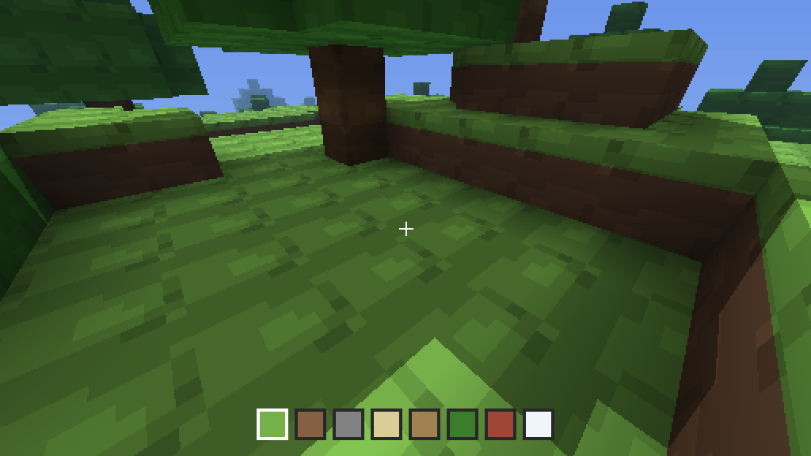

# Bendcraft

An endless voxel world you can walk, jump, break and build, written in
[Bend](https://github.com/bendlang/bend) and rendered by one parallel call:
on the GPU through Metal, or on every core of your machine as WebAssembly.

**Play it in the browser:** https://adrielsantana.github.io/bendcraft/

`W A S D` walk · `space` jumps, and swims up in water · the mouse looks, dragged in the browser (or the arrows) ·
click breaks · right click places (or `J` / `L`) · `1`–`8` choose the block
to place (grass, dirt, stone, sand, wood, leaves, brick, snow) · `9` the
bucket: a click takes a cell of water, a right click pours one · `P`
saves · `F` shows the frame's time · `Esc` quits and saves.

You start with an empty inventory. Break a block to collect its type;
placing spends one of the selected type. The hotbar shows each count
(`99+` above 99), and saves keep the full counts.



## Build and run

Bend 2.0.32 with two fixes that are not released yet,
[bendlang/bend#1132](https://github.com/bendlang/bend/pull/1132) (the lanes
after a grow) and [#1140](https://github.com/bendlang/bend/pull/1140) (a
shared array's read): a frame takes 2.5 times less than on 2.0.25, and
stock 2.0.32 is slower than both. The Makefile runs it with `bun` from a
checkout beside this one; `make BEND=bend` builds with the installed Bend.

```sh
git clone -b bendcraft https://github.com/AdrielSantana/bend ../bend
```

On a Mac with Metal:

```sh
make            # bend main.bend -o build/bendcraft
make run        # ./build/bendcraft --gpu 2GB            a 512 x 512 window
make full       # the screen's visible size, half as many rays a side
./build/bendcraft --gpu 2GB 1470 796 2                   # the same, by hand: a 14" MacBook
```

The two numbers are the window in points (a Retina screen has twice the
pixels: 1470 x 956 points on a 14" MacBook, 2560 x 1664 pixels), the third
how many times fewer pixels a side the render has (a power of two; 1 when
left out). The window's shader walks the image quadtree from the window's
size and stops at the first pixel it meets, so a coarser render scales up
by itself, nearest neighbour, which suits the pixel art. `make full` asks
the screen for its visible size with a line of Swift and takes the title
bar off, at scale 2; `make full SCALE=1` is a ray for every pixel, 20 ms a
frame on a 14" MacBook. The costs are in the table below, and `make profile`
says what each part of a frame costs.

The page is built with the web target of Bend from
[bendlang/bend#866](https://github.com/bendlang/bend/pull/866), a checkout
of that branch:

```sh
make page BEND_WEB=../bend-web/bend2/main.ts   # site/index.html, index.js, index.wasm
make publish                                   # the same onto the gh-pages branch
```

## How it works

**The world is one array, shared by every pixel.** `Array` in Bend has one
owner. Since 2.0.22 an `@unsafe` def may hand one array to both sides of a
fork anyway, two handles to one block that `Array.join` gives back, so the
columns around the player live in the low 2^18 words of an `Array<U32>`
of 2^19 (above them, the far map below): sixteen words a
column, the first a mask whose bit `y` says "there is a block at height
`y`", the next four the types of its 32 solid blocks, four bits each. Word
six is a separate water mask; words seven to fourteen hold the amount of
water in each cell, 0 to 255 units in a byte, the mask's bit set exactly
when the amount is over zero; word fifteen marks the cells the flow steps
next, word sixteen the cells holding less than 255 units; no word remains
spare. A primary ray with water on reads both masks once per column it
crosses and the solid type once, at the hit; only while the window holds
partial water does it read the partial mask with them, and a partial
cell's amount as it enters one. An edit is a few `Array.set` on the host;
a built world costs what an untouched one does. Thirty-two heights in one word is what makes it cheap:
the ray sees a column as a machine word, and break or place is one bit.

**The world is endless.** The terrain is seeded value noise, three octaves,
a pure function of `(x, z)`: sand on the lowest ground, dirt on the other
submerged surfaces, grass on dry ground and snow where it is high;
three of dirt under the top, stone below. About one grass
column in eighty grows a tree when its ground is dry (height at least 12),
a trunk of four wood with a canopy of leaves
over the columns around it; a column takes its wood and leaf bits from the
trees of the 25 columns around it, so a canopy crosses columns without
anyone writing across. The array holds
a ring of 128×128 columns around the player, and a `Map` holds the columns
the player edited. World column `(x, z)` sits at slot `(x·128 + z)·8`; the
array reads its index modulo its size, so any 128×128 window falls
one-to-one on the 16384 column slots, and a reader carries one word,
`base = ox·128 + oz`, to find local column `(lx, lz)`. The render and the
physics only see local coordinates in `[0, 128)`. The corner follows the
player one column at a time, loading the row that came into view, from the
map if it was edited and from the noise if not; an edit is a bit and a
nibble in the ring and the whole column in the map, so it is there when
you come back.

**The render** is a DDA through the ring, one ray per pixel, 60 steps. The
loop returns the solid hit and its distance, plus the first wet entry and
total wet distance. A ray that met nothing goes on over the far map
from where it left the window's columns (`Render.window_exit`), a word a
column for 256x256 columns around the window: the column's run
from the floor, its ground, a trunk or the sea over it, and the canopy
over that, and the highest top of the column's 4x4 cell. The second walk
(`Render.run_far`) takes 128 steps at most: a step crosses a cell where
the ray stays over the cell's highest top, a column elsewhere, and it
stops at its hit, at the map's edge, over the world's top and where the
fog is whole. What it meets is shaded by the window's own look, with the
far map in place of the window's columns: its type from the column's
word, the corners' occlusion from the eight cells around it, the shadow
by the far walk towards the sun to where the window's glance reaches.
The sea is no block to it: it adds the ray's path under the sea's plane
to the window's wet trace and walks on to the bed, so the far sea is the
window's water over its bed, one water with the window's across the
seam, its mirror walked over the far map. A block near the window's
side reads past it the same way: its corners' cells there are the map's,
and its shadow and its mirror, once their glance ends past the side, go
on over the far map from the side. Then it is fogged into
the sky: the ground, its trees and its lakes go on to the horizon, block
for block, and a block looks the same on either side of the walks' seam
(test/terrain.bend: all 192 rays from the start's eye within 4 a
channel). A far map of 4x4 cells, each its
highest block, came first and looked wrong: a tree made a pillar of
leaves four wide, and a cell showed four times a block's size where the
window's walk ends. The look is a `match` after the walk:
a second DDA toward the sun for shadows, a pixel-art tile of four shades per
face, ambient occlusion per vertex from the eight cells around the hit, distance haze and low mist into the sky along the ray. The `!` runs a binary tree down to 4×4 tiles: a
square splits into its two rows, a row into its two squares, as many levels
as the larger side needs, and a half that lies past the render's edge is
one pixel and never a task. The shape follows the GPU runtime, which grows
a frontier of tasks two-way a turn until each of the 128 lanes of a group
holds one, then runs each task on its lane to the end: a two-way tree fills
the frontier with tasks of one size, so a wide frame at every pixel takes
16 ms where the four-way tree took 46, and its pruned form, with some lanes
holding 64 leaves, 110 to 150.

**Still water** fills terrain below y=12, excluding every solid voxel.
Material 8 uses the spare column word, so collisions, picking, shadows and
occlusion keep their original solid mask. The primary ray crosses water
and sees the ground; its accumulated wet distance gives the tint its depth.
Seen from the air the water is dense: the tint takes 1 - 0.88 / (1 + 0.35
d)² of the colour (an exponential's shape, which Bend has no function for:
a half at one block, 0.85 at four), and d counts the light's way down to
the bed as well as the ray's way up, so a look straight down doubles it.
A clear lake showed its bed through every mirror; a dense one leaves the
surface to the sky, the ripples and the bank. An eye under the water keeps
the clear tint (0.18 + 0.72 d / (d + 4)), or a diver would see two blocks.
What lies deep is lit by what little light got down to it: the light
left at a point's depth under the surface (all of it at the level, a
sixth six blocks down) dims whatever a wet ray meets there, from the air
or from under the water alike, so a diver at the bed sees the bed as the
bank does, and the caustic's threads dim with it; the tint's colour
darkens with that depth to a near-black blue, so a deep lake reads as
deep; and the fog a submerged eye sees converges to the colour at the
eye's own depth. Every lake lies at the sea level today, so the depth is
the level less the height; the water's physics will give each column its
level. The tint follows daylight.

The amounts are the first step of the water's physics (the design is in
ROADMAP.md): a cell holds 0 to 255 units, `World.pour` sets one (the
mask's bit follows, a solid cell holds none), and a save writes the eight
amount words after its six.
A cell holding less than 255 units is water only under its plane at
y + amount / 255, and the ray's DDA clips its wet segment to that plane
(`Render.dda`, `Column.lo` and `hi`): a descending ray's entry moves down
to the plane, a ray over the water passes, a ray under it meets the side
face whole, and the reflection, the ripples, Fresnel, the mirror and the
caustic happen on the plane. Between two neighbours' planes there is a
step, a unit tall on a lake at rest, and a ray that crosses it enters
the surface, not a wall: a side entry into water from a cell whose
water the ray passed over is a top entry too (the last cell's water bit
rides in the step count, `Render.keep_wet`; without it every cell
boundary of a settled lake drew a dark dashed line, the rays that met
the step in the band between the planes losing their sky). A side entry
from the air stays a wall, the wedge of a stream. A full cell's plane is
its top face, so the
picture of a still lake is the same bit for bit; and the loop is
specialized on bit 29 of the camera's base, set by `Frame.view_w` when
the world counts a partial cell in the window (`World.partials`), so a
frame without one costs what it did, while a frame with one pays about
a sixth more at 1470×796 (34 → 41 ms on the lake, `make profile`'s last
view). `make water` renders a stair of amounts 32 to 224 in the lake's top
row (`build/water-levels.png`); `make flow` renders the flow itself.

The flow is the second step (`src/flow.bend`): a tick every 256 ms of the
day's clock steps the cells the world has marked. A cell holding a > 0
units first gives the cell below what fits, min(a, 255 - b), then each
of its four sides that holds less takes floor((a - n) / 2) of what is
left, in an order that reverses on odd ticks; every transfer is two
`World.pour` at once, so the volume is kept by construction and no cell
leaves 0..255 (ten laws, and the tests sum a basin over ticks). A neighbour
outside the window is solid, so a lake that reaches the edge holds. The
marks: an edit marks its cell, the one above and the four sides; a move
marks the cell that lost water, the one above it and its sides, and the
one that gained; a marked column's slot is queued once, oldest first,
and a tick steps at most 256 columns (`Flow.budget`), the rest waiting
their turn, so a tick costs a few milliseconds on the host whatever the
lake (`make flow-bench`: a lake draining through shafts, 2 to 3 ms a
tick at 500 to 1600 columns queued). A cell that moved nothing drops out.
A column back in the window from the edits is stepped once where it is
wet, its sides whole. After a stall the flow catches up at two ticks a
frame. What the rule leaves: a difference of one unit between neighbours
does not move, so a surface at rest slopes one unit a cell toward where
it drained; a unit is 1/255 of a block, so the slope is nothing to the
eye (the lake breached in `make flow` rests at `193 192 191 … 173` along
its top row, 0.08 of a block over 22 cells; with eighths it stopped at
`8 8 7 6 5 4 3 2 1 0`, a visible terrace, which is why the unit is a
byte). The price of the fine unit is time: the rule halves a difference
a tick, so a lake levels by diffusion, in about as many ticks as the
square of its length; the breached lake takes 1300 ticks, five and a
half minutes of the clock, with 640 columns active the whole way, 2.5
times the budget, and its whole surface a layer of partial cells after,
so the frame pays the plane clip from then on.

The bucket is the third step, in place of the springs built first (a
cell whose type nibble was 9, refilled by the flow at the end of each
step: water from nothing; they went on 2026-09-22, with `World.made`,
their laws and their tests). The ninth slot is a bucket: a click takes
all the water of the cell before the face aimed at into it, a partial
cell for what it holds, and the units add up (the bag's ninth count, a
natural, saved with the others); a right click fills that cell from the
bucket, if the bucket holds what the cell lacks, 255 for air. Water is
only moved, never made: the world, the bucket and what dried sum to the
same, and the tests carry that ledger through the flow. The hotbar's
ninth count is the full cells the bucket holds, the pours it has. The
pick ignores water, so the cell taken is the one before the solid the
crosshair meets, the bed's under a lake: a scoop from the bottom, and
the water above falls into the gap.

The sink: thin water dries. A cell that holds under four units at the
end of its step loses them, and the world counts what went
(`World.gone`). A cell that holds water at the end of its step rests on
a solid or on full water, since the down move took all that fit, so
falling water never dries; and a lake at rest holds ten units a cell and
more, so it is untouched. Without the sink a poured cell's spill spreads
as a film of a unit or two over every flat reach it comes to and stays,
each cell a partial one for the frame; the springs showed it without a
bound (400 ticks on the spawn's hill, before the sink: 18777 units made,
1212 wet cells and growing a cell a tick). A cell of 255 units spread
over a floor dries six at its thin edge and rests at 249.

A solid placed in water is the fourth step's first half: it shoves the
cell's water up its column into the first cells with room, each marked
so the flow takes it from there, and a lake rises by what the block
took (`World.shove`, one recursive walk up the column with the flow's
probe); what finds no room under a ceiling is gone, counted. Placing a
block in the settled pool lifts its ten units onto the block and the
basin keeps them; a stone at the bottom of three full cells sends a
cell of water past them to the fourth. Collecting water, the other half,
is the bucket above. Distance and height fog use the full solid-hit
path, including air after leaving the lake, so entering water never resets
visibility to zero. Fog colours the background before the water tints it:
a distant block hidden by fog must match the sky seen through the same
wet path. Foreground air haze attenuates that tint, and a top the haze hides
whole is the exact sky. A separate water-fog flag fades to the water
colour by 24 wet blocks, before the 60-step ray limit. Sky rays keep their celestial
discs through short wet paths and converge to the same water colour on
long ones.
This works from below and through vertical sides as well as from above.
Top surfaces also reflect the analytic sky, including its sun, stars and
moon. Fresnel raises reflectance from about 2% head-on toward a mirror at
grazing angles, by a cube where Schlick has a fifth power, so the mirror
shows at the angles a player sees a lake from (14% at 30 degrees, not 5);
disabling it keeps the 2% value. Reflection and Fresnel have
separate flags. The DDA marks the first downward entry through a water top
in a spare bit of its step counter, so vertical sides and submerged eyes
retain absorption alone, even for edited water away from the sea height.
The reflected sky is fogged to the surface, before any water depth, and
fully hidden lakes return the exact atmospheric colour. Ripples tilt the
surface normal with smooth value noise moved by the game clock. The noise
uses world lattice addresses, so loading columns never drags the pattern.
Its analytic gradient takes four hashes and no extra world loads; the
normal fades with distance, to limit shimmer, and in the last degrees
before the horizon; a mirrored ray that a steep ripple would send under
the water is lifted back over it and made a unit again, so the tilt stays
strong where reflections are strongest. Its 8192-ms loop divides the day,
with no jump when the saved day clock wraps. Flag 20 disables ripples.

The world is in that mirror too, by a second ray: a pixel that shows a
water top walks the ring again from where it met the water, along the
mirrored (and rippled) direction, as the shadow walks towards the sun. It
is a dry DDA of 32 steps over the solid bits alone; what it meets gets the
block's colour, its texture and its face's tone, with no occlusion and no
shadow of its own, is fogged by the whole path (eye to water to block) and
laid over the mirrored sky before Fresnel weighs the two. A step crosses
one face, so a ray of direction d always meets what lies within
28 / (|dx| + |dy| + |dz|) blocks, 16 to 28 of them; over the last quarter
of that reach the mirror fades into the sky, and nothing pops in where
the walk ends. A ray that meets nothing leaves the mirrored sky's byte as
it was. The look has a bit of its own, bit 27 of the camera's base word
(the flags word is full).

Seen from above, where the mirror is 2% of the colour, the water shows its
bed, and the bed shows a caustic: the light that came down through the
rippled surface, gathered into bright threads here and taken from there.
The real one follows the surface's curvature down to the bed; this one is
false: the ripples' own value noise read at the bed's point, at twice and
three times the ripples' scale and moving with their clock, the product of
the two ridges squared so the threads are thin, brightening the bed on the
threads and darkening it a little between them, with a mean near zero so
a shallow bed keeps its brightness. It is strongest just under the surface
and gone six blocks down, as the light is, in daylight alone, and fades
out where the eye looks along the surface. The scales are whole numbers
and the lattice is scaled with them, so a ring shift cannot drag the
pattern (a test walks the ring one column each way). No walk and no world
read: four hashes an octave, on the pixels of a wet hit alone. Bit 28 of
the base word; `make water` renders it on and off from above the lake. The threads grow
with the water over the bed, whole from nine tenths of a block, so a film
the flow leaves has none and a bank's wall just under the surface little
(`Render.thickness`: the wet path's height for an eye in the air). This is a function of the ray, which a ray
caster gets for the price of a walk; a screen-space reflection would be a
function of the image, which a pixel of the fork tree cannot read.
Placing an inventory block displaces water, and edits survive ring reloads
and saves. Water cannot be collected with the eight solid-block slots.
A lake lies west of the initial spawn; `make water` exports daytime,
dusk, submerged, reflected sun/moon, the caustic from above, a diver at
the deepest bed, a stair of amounts and each surface-look-off view as
sixteen PNGs. It also exports `build/water-motion.gif`, a 128-frame ripple cycle
with camera and sun fixed, and a contact sheet (requires Pillow).
This is still water: digging leaves a gap until flow is implemented, and
movement remains walking/gravity, with swimming left for a later step. Generated trees require dry grass at their origin;
their canopies can extend over water from the bank. Untouched columns
regenerate with this rule; edited columns in old saves keep their contents,
including any previously saved submerged wood or grass.

**The day clock** is an integer in `Game`, advanced by elapsed milliseconds
at the window loop, independently of the physics and frame rate. One day is
1048576 ms (17 minutes 28.576 seconds); phase zero is dawn, one quarter noon,
one half dusk and three quarters midnight. Its sine and cosine are computed
on the host and the three sun components ride in `Cam`. The shadow walks
with signed steps on all three axes; the terrain dims when the sun sets.
The default starts in the morning. A world-direction sky gradient follows
the sun's height, with a warm glow toward dawn and dusk, a sun disc, fixed
stars fading in at night and a moon opposite the sun. Fog takes the gradient
and glow's colour, without celestial discs; its distance term reaches the
sky at 120 blocks (`Sky.reach`), where the far walk stops; its map ends
128 blocks from the window's centre on an axis. A separate height term thickens in the low ground.

**Collecting and building** use eight natural counts in `Game`. A successful
break reads the cell's actual type and credits that slot; a successful
placement debits the selected slot. Empty spending, occupied cells and
placement anywhere through the player's height are rejected without
changing either side. A break and place in the same tick run in that order,
so the new item may fund one placement. Their shared transfer rule is
proved to conserve the cell plus its inventory count, for every count and
every list of actions. The ring/Map integration is checked by windowless
tests, including repeated breaks and both actions together.

The counts stay on the host. The HUD gets four seven-bit numbers above the
selection in `Cam.sel`, plus four in one extra scalar, `Cam.items`; each is
capped at 100, meaning `99+`. The full inventory is never shared down the
render fork. Labels belong to HUD flag 16 and its existing profile row.

**The world is saved.** `bendcraft.save` in the working directory holds
the corner, position, look, chosen block, day clock and nine counts on its
first line, then one line per edited column: its key and its fourteen
words. The game loads it at start, if it is there, and writes it on `P`
and on quit; the untouched columns are never stored, they come back from
the noise; a line that does not fit the format is skipped. On the page the
file lives in the browser's memory, so it lasts until the tab is closed.
Both `P` and `Esc` save after that tick's edits.

**The player** is 1.8 blocks tall with the eye at 1.6. Walking tests the
feet and the head per axis and stops at walls; gravity pulls, landing snaps
the feet onto the block, space pushes off it. In water at the waist the
player swims (`Player.step_swim`, `World.wet_at`: the cell holds water and
the waist is under its plane): the water's lift nearly balances gravity, so
they sink at a fiftieth of a block a tick and drag; space swims up, to a
bob at the surface with the eye eight tenths over it; a stroke is half a
step; and a wall met swimming is a bank: the player pushes off it as off
the ground, a push the water's clamp holds down until the waist is out,
where it carries them over the bank (the fixture's stroke climbs out of
the lake, and the walk back crosses it and climbs the far shore). Out of
water nothing changed: the old fixture's lines are the same, and eight
swim lines follow them.
A block is never placed on
the player. The hotbar along the bottom shows the eight block types and
the bucket and frames the chosen one, with the available count below
each block's swatch and the full cells it holds below the bucket's.

## Layout

```
main.bend          the window loop, elapsed time, the view, the tick
src/day.bend       integer day phase and the sun direction
src/inventory.bend natural counts, conserved cell/item transfers, packed HUD counts
src/sky.bend       sky gradient, sun, glow, stars, moon and distance/height fog
src/water.bend     wet intervals, tint, fog, Fresnel, reflected sky, ripple normals, the mirror, the caustic
src/util.bend      conversions, bit tests, smoothstep
src/world.bend     noise, terrain, the ring, the map, loads, shifts, edits, solid
src/render.bend    the DDA, the sun, the texture, the occlusion, the mirror's walk, a pixel
src/frame.bend     the frame's tree, its one `!` and the game's view: all that relies on @unsafe
src/player.bend    Game, events, picking, the tick
src/flow.bend      the water's flow: marked cells stepped bottom up
src/save.bend      the save file, and the tick that writes it
LAWS.bend          the rules the checker proves; PROOF.bend closes them
AGENTS.md          for an agent (or a person) about to write Bend here: the gate, the rules
ROADMAP.md         the vision and what comes next: the look, the game, the laws, what waits on Bend
test/lib.bend      what every windowless test needs: expect, ticks, one event, say
test/physics.bend  the game without a window: events through feed and step
test/save.bend     place, walk, save, load: the brick and the position come back
test/inventory.bend transfers, rejected edits, simultaneous input, counts, saves and HUD packing
test/day.bend      signed shadows, sky/fog, clock wrapping, frame rate, the clock's save
test/water.bend    signed wet rays, emerged silhouettes, underwater fog, edits and saves
test/ripples.bend  clock/address packing, stable world noise, normals and wrap continuity
test/water_view.bend sixteen water views and a fixed-sun ripple cycle for test/water.py
test/mirror.bend   the mirror's walk over a placed brick, its reach and fade, the byte a miss keeps
test/mirror_view.bend four views with the world in the mirror and without, for test/mirror.py
test/sky.bend      six fixed sky views, saved as Image trees for test/sky.py
test/bench.bend    five frames on the GPU with checksums, untouched and built
test/profile.bend  what costs what: each look off in turn, the rays' hits and steps
test/trace.py      the frame's dispatch kernel by kernel, from the emitted C
test/terrain.bend  noise rows, lake floor materials, dry roots, canopies, saved columns, the far map and its look
test/far.bend      the far walk over a map written by hand: sides, tops, canopies, the sea and its trace, the look, its shadow and mirror
test/readout.bend  the readout's corner of a frame, printed a character a pixel
test/page.mjs      the page in headless Chrome: drag, click, place, jump
test/fps.mjs       the page's fps on N threads
site/              the page: notes.mjs post-processes the built index.html
```

```sh
make check      # the modules, the tests, the laws
make test       # physics, save and load, terrain, windowless
make bench      # five frames on Metal, untouched and with 300 blocks placed
make profile    # each look off, by size; also night, lake, submerged, night lake, partial water
make sky        # six PNGs and build/sky-contact.png; Python with Pillow
make water      # sixteen PNGs and a ripple animation; Python with Pillow
make flow       # the lake breached into a pit, filling and settled; Pillow
make flow-bench # a lake draining through shafts: ms a tick on the host
make mirror     # build/mirror-sheet.png: four views, mirror on and off; Pillow
make page-test  # the page in headless Chrome, hashes and fps
```

## Numbers

Apple M5, the game closed, twelve rounds alternated with stock Bend 2.0.25
and the order swapped every round (2026-09-27). The bench times the `!`
only, five frames a size with the camera turning; its thirty checksums are
the same on every build that changes nothing visible, both compilers too.

| fastest bench frame | Bend 2.0.25 | 2.0.32 with #1132 and #1140 |
|---|---|---|
| 512×512 | 5 ms | 3 ms |
| 512×512, 300 blocks placed | 5 ms | 3 ms |
| 735×398, a 14" MacBook at scale 2 | 13 ms | 6 ms |
| 960×540, a 1920×1080 window at scale 2 | 23 ms | 9 ms |
| 1470×796, a 14" MacBook at every pixel | 48 ms | 19 ms |
| 1920×1080 | 91 ms | 33 ms |

Stock 2.0.32 took 215 ms at 1470×796 when #1140 was measured: its fix of
a race ([#975](https://github.com/bendlang/bend/issues/975)) made every
read of a shared array two atomic loads, dear on Metal
([#1139](https://github.com/bendlang/bend/issues/1139)). The page was last
measured before the sky: 31 fps at 512×512 on ten threads, 7 on one. On
the page, `?size=1024x576x2` in the address gives the wide frame, and the
fullscreen link scales whatever is rendered to the screen.

## What costs what

`make profile` renders a view five times with every look on, then with
each look off in turn (the camera's `fl` flags, and the world in the
mirror and the caustic, bits 27 and 28 of the base word), then the rays
alone, and prints the `!` a frame; then it renders the view twice more
with numbers for pixels, how many rays reach a block and how many DDA
steps a ray walks to its hit, each pixel weighed by the square it stands
for. Its views are the bench's at four sizes, then at 1470×796 night
looking at the moon, a lake looking west, under its water, the night lake
with the moon in it, and the lake with partial water in the window. The
least of four rounds alternated with 2.0.25 as above, ms a frame:

| | bench's view, 735×398 | bench's view, 1470×796 | lake | night lake |
|---|---|---|---|---|
| all on | 6.2 | 21.8 | 21.4 | 16.8 |
| shadow off | 5.6 | 19.2 | 18.2 | 16.8 |
| occlusion off | 6.2 | 20.2 | 19.0 | 15.8 |
| texture off | 6.8 | 19.8 | 19.6 | 16.4 |
| water off | 5.4 | 16.4 | 16.0 | 11.8 |
| sky reflection off | 5.8 | 19.4 | 17.6 | 13.6 |
| world mirror off | 5.8 | 19.4 | 19.0 | 13.8 |
| caustic off | 6.2 | 20.8 | 19.8 | 17.0 |
| rays alone | 4.0 | 12.4 | 10.8 | 9.2 |
| all on, 2.0.25 | 14.0 | 51.6 | 49.2 | 39.6 |

The other looks (distance and height fog, HUD, day cycle, gradient, sun,
glow, stars, moon, water fog, Fresnel, ripples) are arithmetic on a pixel
and read within the noise of all on. In the bench's view 49% of the rays
reach a block, after 41.4 steps with a sky ray's 60; at the lake 77%,
after 31.3.

The rays alone are over half of a frame. After them come the walks a look
adds, since a DDA step costs about the same wherever it happens, the frame
being its slowest lane: the shadow's 24 steps, the mirror's 32. Water is
the dearest look, 5 ms of the lake's 21, because it tracks the wet
intervals along every ray's 60 steps. Two lessons of the first profile
hold: a ray that stopped at its hit walked a third of the steps and made
the frame slower, the lanes of a SIMD group then leaving the loop at
different steps; and a `Bool.pick` is strict, so a look that is off is
skipped by a `match`, or it is paid for anyway.

`test/trace.py` goes one level down: it patches the emitted C so the
frame's dispatch runs as one command buffer a kernel, and prints each
kernel's time and the tasks left in the lanes' rings (`bend
test/bench.bend -o build/bench.c && python3 test/trace.py build/bench.c &&
./build/bench_trace`). It reaches into the runtime's text, written for
2.0.25's; it does not find 2.0.32's yet.

## The frame's time, in the game

`F` puts a readout in the frame's corner: `16.4 MS  60 FPS`. The first
number is the `!` alone, the render, as the bench times it; the second is
the frames that reached the screen, which the display's rate caps, so a
render of 5 ms still reads 60 or 120. `main.bend` runs the window's loop
itself, in `App.run`'s shape, to read the clock on each side of the view
and not around the wait for the screen; twice a second it publishes the
mean since. The two numbers ride to the GPU in a word of their own,
`Cam.stat` (they rode in spare bits of the flags, the inventory and the
ring-address words while the camera was kept at 14 words; the fifteenth
word measured free, so the splices and their 22 laws went, 2026-09-22;
the sixteenth, `Cam.far`, the far map's address, measured free too).
Only 14 low address bits affect the ring's wrapping array reads; bits
14..26 carry the ripple clock.
The HUD draws the readout with glyphs of 3 × 5 picked by divisions
and masks (no table, no variable shift). With the readout off the frame
is the same bit for bit: the bench's checksums and its times did not move.

## Laws

`LAWS.bend` states what the checker can decide: integer and bit rules on the
values the game uses. The pick word packs and unpacks; a 128×128 window of
the ring spans its 16384 column slots exactly; placing sets one bit,
breaking clears it, breaking air changes nothing; a type's nibble writes
and reads back without touching its neighbours, and the device's read (a
select, since the GPU never shifts by a variable) agrees with the host's;
the terrain's layers are what they should be, a trunk packs as wood with
leaves over it and grass under it, and the packed word the loader writes
reads back the same; a key the game does not know sets no bit;
the readout's numbers read back from their word and stop at their room.
The day phase
returns after a whole turn for every `U32` clock value, including overflow,
proved by induction over the low 20 bits. This is the sun's sole integer
input. Its last millisecond advances to dawn. The inventory uses natural
counts: a transfer conserves the cell plus its count, and induction extends that to every list of actions.
Empty spending and occupied placement are rejected, break then place
restores the count, and edits preserve the number of inventory slots.
The HUD packing has mixed-slot and boundary laws; save/quit edges survive
the physics step. Still-water laws cover generation above ground, the sea
limit, banks preserved on water placement, displacement, neighboring bits
and material packing. Water fog has its own flag, enabled by default.
Three tree laws check all 32 column heights:
submerged ground and snow reject roots, dry grass accepts them. Two lake
floor laws cover the submerged dirt heights and their material packing;
dry shoreline grass, low sand and high snow keep their existing laws.
Five surface laws cover independent flags and packing
the top-entry bit with all 61 step counts and four face codes. Float tests
cover Fresnel endpoints and growth, reflected sun/moon, signed entry,
submerged eyes, foreground banks and distant fog.
Six ripple laws include the 8192-ms period for every clock word,
boundary packing checks, flag independence and
integer recentering. Windowless tests exhaust all 8192 phase values,
16384 ring addresses and 257 FPS inputs, and check unit normals,
grazing reflection, positive/negative recentering and temporal continuity.
Four mirror laws keep its look in bit 27 of the base word: it reads back,
it is off unless asked for, and the ring address and the ripple clock
pass through it untouched. Windowless tests walk the
mirror's ray to a placed brick along an axis and across, past its reach,
and to the sky, and check the fade and the byte a miss leaves alone.
Two more keep the caustic's look in bit 28. Sixteen amount laws: a column
born of the terrain or a save is full where it is wet, an amount reads
its byte, a byte written reads back and leaves the others, the device's
read agrees with the host's, water placed is a full cell, a solid placed
holds none, a pour sets the amount and the bit, clears the bit at zero,
caps at 255 and does nothing to a solid, and the partial mask has a bit
for a poured cell and none for a full one. Ten flow laws bound one
transfer. Eight bucket laws: it takes a cell whole and nothing from a
solid, a pour is what the cell lacks, 255 into air and nothing into a
full cell or a solid, the bucket is the ninth slot and the HUD shows its
full cells above the readout's numbers. Seven shove
laws: what fits is the room, all of less, nothing in full or in a
solid; a solid placed on water shoves its amount, water placed and a
break shove nothing. Eleven far-map laws: the window wraps under the far map,
its columns live above it, the render reads the word the host wrote, a
column is its run and its canopy, its top is the higher of the two,
leaves inside the run are the run's, a far column's types are the
window's for the ground, the trunk and the sea, the sea is its plane
over a lower ground, and it is not solid. There are 132 laws:
eight universal claims and 124 concrete
checks. Integration tests exercise the actual ring edits, all eight types,
both actions in one tick, and save/load through `P` and `Esc`.
The historical physics fixture supplies its one sand placement explicitly;
its output hash stays unchanged, while the inventory tests check an empty
new game.
`bend PROOF.bend` is the gate. The float physics, a player
never inside a block or a jump that lands where it left, is checked by
`test/physics.bend`, whose lines the README of the history records.

## History

Bendcraft began as `gfx/05_craft.bend` in
[metal-bending](https://github.com/AdrielSantana/metal-bending), a notebook
of what Bend costs on Metal. The wall it hit there, an editable world read
through a shared tree, was
[bendlang/bend#885](https://github.com/bendlang/bend/issues/885); Bend
2.0.22 answered it with the array fork, and this repository carries that
file's history from its first commit. Open upstream:
[#923](https://github.com/bendlang/bend/issues/923), a way to go full
screen, and [#925](https://github.com/bendlang/bend/issues/925), the shape
of the frame's tree deciding the lanes' load, with a 90-line reproduction,
which [#1132](https://github.com/bendlang/bend/pull/1132) answers.

Written by Claude (Anthropic) with Adriel Santana.
